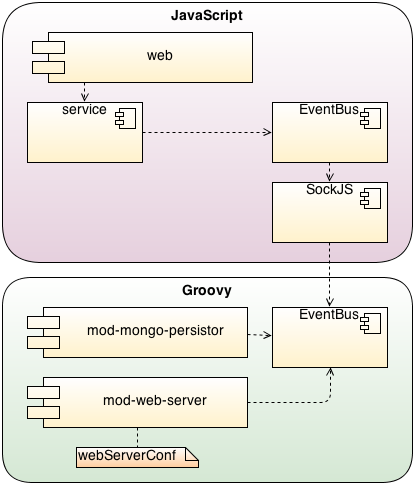
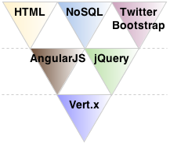

# Single-page application with Vert.x framework and AngularJS #

This example application consist of a small domain model with only simple business logic to add, remove and list departments and employees. This reference implementation serves as proof of concept to demonstrate the feasibility behind polyglot programming and polyglot programming pyramid. Simplicity of the application limits its ability to demonstrate some cases where different programming languages and paradigms might prove useful. This proof of concept is given to verify that the concept has the potential of being used.

## Project Structure ##

This project uses Maven for managing the project, and Vert.x module repository to fetch required modules.

Structure of the project follows the principles of a thin server architecture to produce a single-page application (SPA).

A single-page application is a web application within a single web page with a goal of providing more fluid user experience similar to a desktop application. Only a single page load is required to retrieve all necessary HTML, JavaScript and CSS. Additional resources are dynamically loaded and added to the page on request, generally in response to user interactions. A single-page application does not load at any point in the process, neither the control transfers to another page. Modern web technologies - in this case Twitter Bootstrap and jQuery - are used to provide the perception and navigability of separate logical pages in the application.

## Polyglot Programming ##

Polyglot programming pyramid specifies the programming languages, frameworks and libraries used in the project. Groovy is the programming language of choice on the server-side and JavaScript on the client-side. Both of them utilize the native Vert.x API implementations. An out-of-the-box MongoDB persistor bus module is used as a NoSQL document database that provides the necessary data access over the event bus.

The implemented SPA uses dynamic communication to interact with the web server behind the scenes. The Vert.x event bus is utilized in conjunction with SockJS to bridge the client-side with the server-side application. The server-side application deploys the web server, enables the SockJS bridge, and also deploys the MongoDB persistor bus module which instantly registers on the event bus.

Requests to the server over the event bus result in raw data in JSON representation being returned. A client-side AngularJS JavaScript implementation uses the returned JSON to update the partial area of the document object model (DOM). AngularJS is web framework used at the client-side to implement the web application, and for example to provide declarative templates with data-binding.

The web module contains web application specific components implemented on top the AngularJS framework and also the pure HTML view layer enhanced with Angular directives. Twitter Bootstrap is used to enhance the content presentation and jQuery is utilized to provide dynamic features on the client-side.

### The MIT License (MIT) ###

Copyright (c) 2013 Juhana Harmanen

Permission is hereby granted, free of charge, to any person obtaining a copy of
this software and associated documentation files (the "Software"), to deal in
the Software without restriction, including without limitation the rights to
use, copy, modify, merge, publish, distribute, sublicense, and/or sell copies of
the Software, and to permit persons to whom the Software is furnished to do so,
subject to the following conditions:

The above copyright notice and this permission notice shall be included in all
copies or substantial portions of the Software.

THE SOFTWARE IS PROVIDED "AS IS", WITHOUT WARRANTY OF ANY KIND, EXPRESS OR
IMPLIED, INCLUDING BUT NOT LIMITED TO THE WARRANTIES OF MERCHANTABILITY, FITNESS
FOR A PARTICULAR PURPOSE AND NONINFRINGEMENT. IN NO EVENT SHALL THE AUTHORS OR
COPYRIGHT HOLDERS BE LIABLE FOR ANY CLAIM, DAMAGES OR OTHER LIABILITY, WHETHER
IN AN ACTION OF CONTRACT, TORT OR OTHERWISE, ARISING FROM, OUT OF OR IN
CONNECTION WITH THE SOFTWARE OR THE USE OR OTHER DEALINGS IN THE SOFTWARE.

